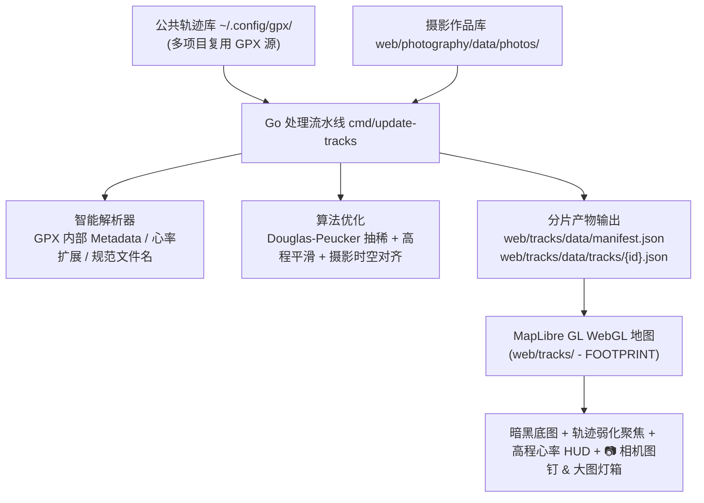

# 🌲 足迹（Footprint）数字资产地图全栈设计与实施方案

## 1. 目标与定位 (Vision & Core Decisions)

将个人所有户外与出行轨迹（越野跑、路跑、徒步、骑行、自驾、火车/旅行等）转化为高质量的个人**数字足迹资产（Footprint Digital Assets）**，并与全站摄影作品完成时空闭环联动。

### 核心决策与已落地特性
1. **统一公共源存储**：原始 GPX 文件统一存放在用户目录 `~/.config/gpx/`，供所有工具与项目公共复用。
2. **模块与导航命名**：全站命名为 **`FOOTPRINT`（山河足迹）**，中文版与全站导航无缝融合。
3. **多重底图主题切换**：默认采用**高对比度暗黑地形（Dark Topo）**，并提供**户外等高线（Outdoor Topo）**与**卫星影像（Satellite）**一键无缝切换。
4. **单轨迹聚焦弱化机制 (Focus Isolation & Dimming)**：选中某条轨迹时，其余所有背景轨迹自动降色至 0.08 透明度与暗灰低调色，消除视觉杂乱，起终点标出 🟢 S 与 🏁 F。
5. **运动心率完整持久化与展示**：提取并保存 `avg_hr`、`max_hr` 及逐点心率，在列表卡片、Profile HUD 和高程图 Tooltip 中实时联动。
6. **摄影作品与户外轨迹时空自动对齐系统 (Photo & Track Synergy)**：
   - 自动扫描相册照片元数据（EXIF 拍摄时间、GPS DMS 经纬度、尼康机身与镜头参数）。
   - 时空双重锚定与线性插值对齐，在地图轨迹线上精准渲染 📷 相机图钉。
   - 提供沿途照片胶片轮播栏（Photo Strip），点击照片地图平滑飞至拍摄地，支持呼出原生大图灯箱预览（Lightbox Modal）。
7. **Canonical UI/UX 架构与视口自适应**：
   - 遵循 `site-shell-page`、`site-shell-header` 与 `site-shell-main` 栅格规范。
   - 页面支持自然上下平滑滚动，顶部菜单栏随时可见可切换。
   - 纯正简体中文文案与格式化输出。

---

## 2. 数据流水线与时空对齐架构 (Pipeline Architecture)

### 2.1 存储路径
- 原始 GPX 集中存放路径：`~/.config/gpx/`
- 相册元数据输入路径：`web/photography/data/photos/*.json`
- 分片产物输出目录：`web/tracks/data/manifest.json` 与 `web/tracks/data/tracks/*.json`

### 2.2 核心算法与数据模型
- **Haversine 大圆距离**：计算累计里程与瞬时距离。
- **Douglas-Peucker 智能抽稀**：
  - 全景底图（Manifest）：8米容差，将整体数据量压缩 80% 以上，保证全景首屏秒开；
  - 详情分片（TrackDetail）：2.5米容差，完整保留山野细节、高程与逐点心率。
- **摄影时空匹配引擎 (`photo_matcher.go`)**：
  - 提取照片 EXIF 时间戳与 DMS 经纬度；
  - 若照片无 GPS，根据时间在轨迹坐标中做线性插值计算经纬度；
  - 支持多级 CDN 回退（本地原始文件 -> 火山引擎 TOS -> Cloudflare R2）。

---

## 3. 前端交互与视觉规范 (UI/UX Specification)

- **页面骨架**：
  - `header[data-site-shell]`：统一顶栏，`FOOTPRINT` 高亮激活；
  - `section.footprint-hero`：标题 `FOOTPRINT` 与 `#site-page-anchor` 锚点；
  - `nav.footprint-tabs`：分类选项卡（全部、徒步、越野跑、路跑、骑行、行走）；
  - `div.footprint-intro-row`：介绍与数据概要 Strip；
  - `section.footprint-workspace`：内嵌式 WebGL 地图工作区，支持一键全屏模式。
- **交互联动**：
  - 左侧轨迹卡片列表与地图双向 Hover/Click 响应；
  - Canvas 渲染高程渐变图，滑动光标实时指示距离、海拔与心率（❤️ 165 bpm）；
  - 点击地图 📷 相机图钉或沿途胶片条弹出大图灯箱预览（支持 ESC 键关闭）。
